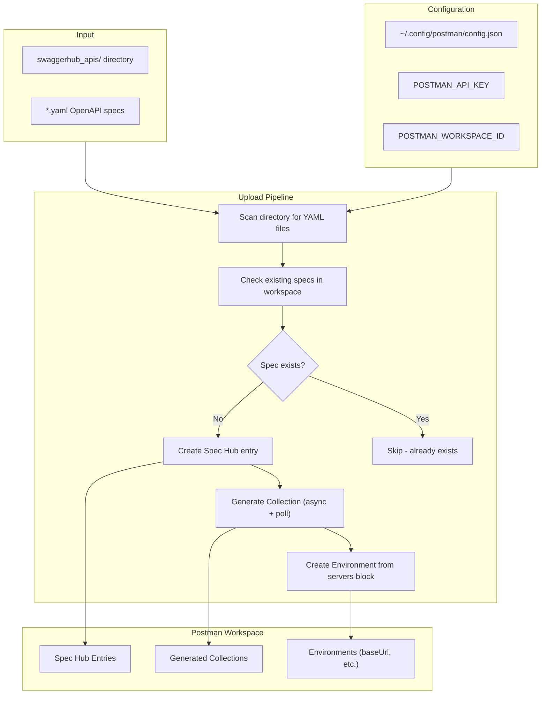
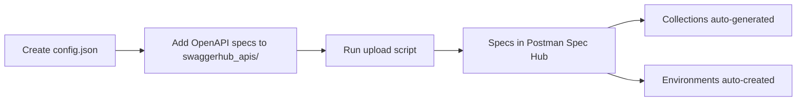

# Cust-LIFE360-spechub-uploader

Automation tool that discovers OpenAPI specification files and uploads them to a **Postman workspace** via the Spec Hub API, with automatic collection generation and environment setup.

## How It Works



## Setup



### Prerequisites

- Python 3.8+
- A valid Postman API key with workspace write permissions

### Configuration

Create a config file (default: `~/.config/postman/config.json`):

```json
{
  "POSTMAN_API_KEY": "PMAK-your-api-key",
  "POSTMAN_WORKSPACE_ID": "your-workspace-id"
}
```

> **Security:** The `test_config/` directory is git-ignored to prevent accidental credential commits. Never commit API keys.

## Usage

```bash
python tools/upload_postman_apis.py
```

### Options

| Flag | Default | Description |
|------|---------|-------------|
| `--config` | `~/.config/postman/config.json` | Path to credentials config file |
| `--input` | `swaggerhub_apis` | Directory to scan for OpenAPI YAML files |

### Adding New Specs

1. Create a folder under `swaggerhub_apis/` with the project name
2. Place your OpenAPI YAML file inside (e.g., `swaggerhub_apis/my-api/my-api-1.0.0.yaml`)
3. Run the upload script — it will only process new specs (idempotent)

## Included Specs

| Path | Description |
|------|-------------|
| `swaggerhub_apis/life360/circles-api-1.0.0.yaml` | OpenAPI 3.0 spec for the Life360 Circles API (`GET /circles`, `GET /circles/{circleId}`) against `https://api.life360.com/v3` |

## Project Structure

```
Cust-LIFE360-spechub-uploader/
├── tools/
│   └── upload_postman_apis.py        # Main uploader script
├── swaggerhub_apis/
│   └── life360/
│       └── circles-api-1.0.0.yaml    # Sample OpenAPI spec
├── test_config/
│   └── config.json                   # Local test credentials (git-ignored)
└── .gitignore
```
