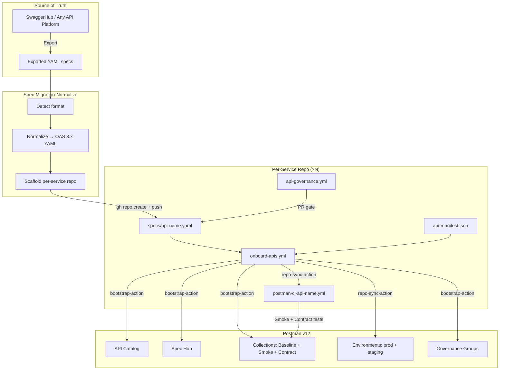
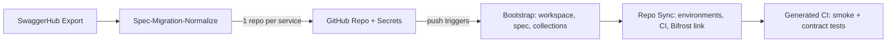

# Life360 SwaggerHub → Postman v12 Migration

CI-driven pipeline that migrates Life360 APIs from SwaggerHub into the **Postman v12 API Catalog** with governance, contract testing, and environment management baked in from day one.

Built on the [`postman-cs` open-alpha GitHub Action suite](https://github.com/postman-cs/postman-api-onboarding-action) and the companion [Spec-Migration-Normalize](https://github.com/postman-cs/postman-spec-migration-normalize) action:

| Action | Role |
|--------|------|
| **Spec-Migration-Normalize** | Ingest any spec format, normalize to OAS 3.x, scaffold per-service repos |
| [`postman-api-onboarding-action`](https://github.com/postman-cs/postman-api-onboarding-action) | Composite orchestrator — chains bootstrap → repo-sync |
| [`postman-bootstrap-action`](https://github.com/postman-cs/postman-bootstrap-action) | Workspace, Spec Hub upload, collection generation, governance |
| [`postman-repo-sync-action`](https://github.com/postman-cs/postman-repo-sync-action) | Environments, monitors, CI workflow generation, git linking |
| [`postman-insights-onboarding-action`](https://github.com/postman-cs/postman-insights-onboarding-action) | Insights discovered-service linking (optional, for K8s) |

## Architecture



## Pipeline at a Glance



**Stage 1 — Normalize** — `Spec-Migration-Normalize` ingests exported specs (OpenAPI, Swagger 2.0, RAML, API Blueprint, Postman Collections, etc.), converts them to clean OpenAPI 3.x YAML, and scaffolds a **self-contained GitHub repo per service** with pre-configured workflows and manifest.

**Stage 2 — Repo creation** — each scaffolded repo is pushed to GitHub with `POSTMAN_API_KEY` and `GH_FALLBACK_TOKEN` secrets set automatically.

**Stage 3 — Onboard** — the push triggers `onboard-apis.yml` which runs `postman-api-onboarding-action`. Each API gets:

- A dedicated Postman **workspace** named `[L360] <api-name>` in the **API Catalog**
- The OpenAPI spec uploaded to **Spec Hub**
- **Baseline**, **Smoke**, and **Contract** collections generated from the spec
- **Environments** with runtime URLs (prod, staging)
- **Governance group** assignment
- A per-API **CI workflow** committed to the repo for ongoing smoke and contract testing
- **Workspace ↔ repo git link** via Bifrost

**Stage 4 — Test** — auto-generated CI runs smoke and contract tests against the live runtime URLs from each environment.

## Bulk Migration from SwaggerHub

The recommended approach for migrating an entire SwaggerHub catalog:

### 1. Export specs from SwaggerHub

Download all API specs as YAML/JSON into a local directory:

```
~/Desktop/life360-swaggerhub-exports/
├── life360-circles-api-1.2.0.yaml
├── life360-location-api-2.0.0.yaml
├── life360-notifications-api-1.0.0.yaml
├── life360-places-api-1.1.0.yaml
└── life360-safety-api-1.0.0.yaml
```

### 2. Run the spec normalizer

```bash
cd Spec-Migration-Normalize

INPUT_DIR=~/Desktop/life360-swaggerhub-exports \
OUTPUT_DIR=~/Desktop/life360-scaffolded-repos \
INGEST_MODE=repo-per-service \
ORGANIZATION=Life360 \
DOMAIN=life360-platform \
DOMAIN_CODE=L360 \
DEFAULT_ENVIRONMENTS='["prod","staging"]' \
STRIP_TITLE_PREFIX=Life360 \
GOVERNANCE_GROUP="Life360 API Platform" \
PRIVATE_NETWORK_FOLDER="Life360 APIs" \
TEMPLATES_DIR=./templates \
python3 ingest.py
```

This produces a self-contained repo directory per API:

```
life360-scaffolded-repos/
├── circles-api/
│   ├── .github/workflows/onboard-apis.yml
│   ├── .github/workflows/api-governance.yml
│   ├── specs/circles-api-1.2.0.yaml
│   ├── api-manifest.json
│   └── README.md
├── location-api/
├── notifications-api/
├── places-api/
└── safety-api/
```

### 3. Create repos and set secrets

For each scaffolded service:

```bash
cd life360-scaffolded-repos/circles-api

gh repo create <org>/life360-circles-api --public \
  --description "Life360 circles-api — one repo, one service, one workspace"

echo "$PMAK" | gh secret set POSTMAN_API_KEY --repo <org>/life360-circles-api
echo "$GH_PAT" | gh secret set GH_FALLBACK_TOKEN --repo <org>/life360-circles-api

git init -b main && git add -A
git commit -m "feat: scaffold circles-api from SwaggerHub export [skip ci]"
git remote add origin https://github.com/<org>/life360-circles-api.git
git push -u origin main
```

### 4. Trigger onboarding

```bash
gh workflow run onboard-apis.yml --repo <org>/life360-circles-api --ref main
```

The onboard workflow creates the Postman workspace, uploads the spec, generates collections, and commits CI test workflows back to the repo.

### 5. Verify

Check the Actions tab for each repo, or query the Postman API:

```bash
curl -s https://api.getpostman.com/workspaces -H "x-api-key: $PMAK" | \
  python3 -c "import json,sys; [print(f'  {w[\"name\"]}: {w[\"id\"]}') for w in json.load(sys.stdin)['workspaces'] if 'L360' in w['name']]"
```

## Quick Start (single-repo mode)

For adding APIs to this repository directly (without per-service repos):

### 1. Configure secrets

| Secret | How to get it |
|--------|---------------|
| `POSTMAN_API_KEY` | Postman → Settings → API Keys → Generate (starts with `PMAK-`) |
| `POSTMAN_ACCESS_TOKEN` | `postman login` → `cat ~/.postman/postmanrc \| jq -r '.login._profiles[].accessToken'` |
| `GH_FALLBACK_TOKEN` | GitHub PAT with `workflow` + `repo` + `actions:write` scopes |

```bash
gh secret set POSTMAN_API_KEY       --repo <owner>/<repo>
gh secret set POSTMAN_ACCESS_TOKEN  --repo <owner>/<repo>
gh secret set GH_FALLBACK_TOKEN    --repo <owner>/<repo>
```

> `POSTMAN_ACCESS_TOKEN` is a session token required for governance assignment and workspace linking. It expires and must be refreshed periodically.

### 2. Add API specs

Place OpenAPI YAML files under `swaggerhub_apis/<project>/`. **Drop in as many as you want — the matrix onboards one workspace per manifest entry.**

```
swaggerhub_apis/
└── life360/
    ├── circles-api-1.0.0.yaml
    ├── places-api-2.1.0.yaml
    └── safety-api-1.0.0.yaml
```

Each onboarded API gets its own isolated state tree:

```
.postman/
├── circles-api/
│   ├── resources.yaml
│   └── workflows.yaml
├── places-api/
│   └── ...
postman/
├── circles-api/
│   ├── collections/
│   ├── environments/
│   └── globals/
├── places-api/
│   └── ...
```

### 3. Register APIs in the manifest

Add each API to `life360-api-manifest.json`. Each entry produces a workspace named `[<DOMAIN_CODE>] <name>` in the API Catalog:

```json
{
  "organization": "Life360",
  "domain": "life360-platform",
  "domain_code": "L360",
  "apis": [
    {
      "name": "circles-api",
      "spec_path": "swaggerhub_apis/life360/circles-api-1.0.0.yaml",
      "spec_url": "",
      "environments": ["prod", "staging"],
      "runtime_urls": {
        "prod": "https://api.life360.com/v3",
        "staging": "https://staging-api.life360.com/v3"
      }
    }
  ]
}
```

> **Optional:** if your Postman team has Governance Groups configured, add a top-level `governance_mapping` block (e.g. `{"life360-platform": "Life360 API Platform"}`) and the bootstrap action will assign each workspace to that group post-onboard. Omit the block in test/sandbox teams that don't have governance groups — otherwise the action surfaces a non-fatal `404 Not Found` warning.

### Spec ↔ Environment hookup ("prod to prod")

Each manifest entry under `environments` becomes a workspace environment named `<api-name> - <env-name>` (e.g. `circles-api - prod`). The env's `baseUrl` variable is set to the matching `runtime_urls.<env>` value from the manifest, which is also expected to match one of the spec's `servers[].url` entries.

When a developer opens the spec in **Spec Hub** and selects this env, every request resolves `{{baseUrl}}` against that URL — that's the prod-to-prod (or staging-to-staging) hookup. The `onboard-apis.yml` workflow has a post-onboard verification step that fails the run if the env's `baseUrl` drifts from the manifest's `runtime_urls.<env>`, so this stays correct on every push.

### API Catalog system-environment hookup (Postman Insights)

To take the linkage one level deeper and have each workspace environment hooked to the **API Catalog system environment** for the corresponding runtime cluster, set `insights.enabled: true` and `insights.cluster_name` in the manifest:

```json
{
  "insights": {
    "enabled": true,
    "cluster_name": "life360-prod"
  },
  ...
}
```

When this is set, the onboarding workflow will:

1. Query Bifrost's `/api/v1/onboarding/discovered-services` for services discovered by the Postman Insights DaemonSet running in the named cluster.
2. Match each manifest API's name (e.g. `circles-api`) against the discovered service suffix (e.g. `life360/circles-api`).
3. Pull the `systemEnvironmentId` off the matched record and build a `system-env-map-json` of `{ "<env>": "<system_env_id>", ... }` for every env in the API's `environments` list.
4. Pass `enable-insights: true`, `system-env-map-json`, and `cluster-name` to the onboarding action chain. The repo-sync action then calls `/api/internal/system-envs/associate` to link each workspace env to its system environment.

**Prerequisites for this layer to actually fire:**

- The [Postman Insights DaemonSet agent](https://learning.postman.com/docs/insights/get-started/kubernetes/daemonset) must be running in the customer's Kubernetes cluster (with `--discovery-mode` and `POSTMAN_INSIGHTS_CLUSTER_NAME=<cluster-name from manifest>`).
- Each service the manifest references must be deployed in that cluster, observable by the agent (i.e. receiving real HTTP traffic).
- An Insights project must be initialized for the team (one-time UI step in Postman: API Catalog → Integrated Services → set up project / acknowledge first discovered service). This is what populates `systemEnvironmentId` on every subsequent discovered service for the cluster.

**Graceful skip:** if any prerequisite is missing — agent not deployed, no traffic yet, services discovered but not yet integrated, no `POSTMAN_ACCESS_TOKEN`, or `insights.enabled: false` — the resolver step prints a `::warning::` and the onboarding action runs in normal Spec-Hub-only mode. The next push will pick up the linkage automatically once the prerequisites are in place. No code change needed when the cluster comes online.

### 4. Push and watch

```bash
git add swaggerhub_apis/ life360-api-manifest.json
git commit -m "feat: add circles-api for v12 onboarding"
git push
```

The `onboard-apis` workflow runs automatically. Check the Actions tab for a per-API summary with workspace URLs, spec IDs, and collection IDs.

## Idempotency

The pipeline is designed to be safely re-runnable. Five layers prevent duplicate resources and protect against state-file loss:

1. **Per-API state isolation** — every service has its own `.postman/<api-name>/resources.yaml` and `postman/<api-name>/` artifact tree. Onboarding service A never overwrites service B's state.
2. **Live ID validation** — the resolve step calls `GET /workspaces/{id}`, `GET /collections/{uid}`, and `GET /environments/{uid}` for every stored ID before passing them to the action. Anything that returns 404 is dropped from the inputs and the on-disk state file, and the action recreates it. This is what protects against the `400 / 404 "team feature is not available"` and `404 environment not found` errors caused by manual deletions in the Postman UI.
3. **Name-based workspace fallback** — if `.postman/<api>/resources.yaml` is missing or its workspace ID 404s, the resolve step searches `GET /workspaces` for `[<DOMAIN_CODE>] <api-name>` and reuses that ID before creating anything new.
4. **Workflow trigger guards** — `onboard-apis.yml` uses `paths-ignore` for `.postman/**`, `postman/**`, and `.github/workflows/postman-ci-*` plus `[skip ci]` on persist commits so artifact commits don't re-trigger onboarding.
5. **CI workflow path filters** — auto-generated `postman-ci-*.yml` files include `paths-ignore` to prevent cascading runs from sync artifact commits.

### Recovering from deletions

| You did | What happens on next run | What you do |
|---|---|---|
| Deleted `.postman/<api>/resources.yaml` | Resolve step does name lookup `[<DOMAIN_CODE>] <api>`, reuses existing workspace, walks specs/collections/envs to rebuild state file. | Nothing — just push. |
| Deleted an environment in the Postman UI | Resolve step's `GET /environments/{uid}` returns 404, env UID is dropped, action recreates the env. | Nothing — just push. |
| Deleted the workspace in the Postman UI | Resolve step's workspace 404 + name lookup miss → action creates a fresh workspace, spec, and collections from scratch. | Nothing — just push. |
| Want to fully wipe and rebuild | Use `workflow_dispatch` with `force-rebuild: true` to ignore stored IDs entirely. | `gh workflow run onboard-apis.yml -f force-rebuild=true`. |

## Workflows

| Workflow | Trigger | Purpose |
|----------|---------|---------|
| `onboard-apis.yml` | Push to `main` (spec/manifest changes), `workflow_dispatch` | Full onboarding pipeline per API |
| `api-governance.yml` | Pull request (spec/manifest changes) | Manifest validation, OpenAPI structure check (swagger-cli), Postman CLI preflight |
| `postman-ci-<api-name>.yml` | Auto-generated by `repo-sync-action` | Smoke + contract tests using Postman CLI |

## Governance

Governance is enforced at two levels, with the **Postman CLI as the canonical tool** wherever it can drive the check:

1. **Pre-merge (CI)** — `api-governance.yml` runs three pre-merge gates on every PR that touches `swaggerhub_apis/**` or `life360-api-manifest.json`:
   - **Manifest schema** — JSON syntax + every entry has `name`, `spec_path`, `environments`, valid `runtime_urls` mapped to spec `servers[]`.
   - **OpenAPI structure** — `swagger-cli validate` confirms each spec parses as valid OpenAPI 3.x.
   - **Postman CLI preflight** — installs the Postman CLI and runs `postman login --with-api-key` against the team PMAK so PRs fail fast if the secret is missing or scoped to the wrong team.

2. **Post-merge (Postman)** — `onboard-apis.yml` uploads each spec to **Spec Hub**, which runs the team's configured governance ruleset on every change automatically (the same engine the Spec Hub UI uses). If `governance_mapping` is set in the manifest, the bootstrap action also assigns the workspace to the named governance group.

## Testing

After the first onboarding run, `repo-sync-action` auto-generates a CI workflow per API at `.github/workflows/postman-ci-<api-name>.yml`. These workflows use the Postman CLI to run:

- **Smoke tests** — basic reachability and response shape validation
- **Contract tests** — full schema compliance against the spec

Collection UIDs and environment IDs are read from `.postman/resources.yaml` (committed by repo-sync).

## Per-Service Repo Structure

Each scaffolded per-service repo (the recommended pattern):

```
life360-circles-api/
├── .github/
│   └── workflows/
│       ├── onboard-apis.yml                # Onboarding pipeline
│       ├── api-governance.yml              # PR-time spec validation
│       └── postman-ci-circles-api.yml      # Auto-generated test workflow
├── .postman/                               # Generated by repo-sync (auto-committed)
│   ├── resources.yaml
│   └── workflows.yaml
├── specs/
│   └── circles-api-1.2.0.yaml             # Normalized OpenAPI 3.x spec
├── postman/                                # Generated by repo-sync (auto-committed)
│   ├── collections/
│   ├── environments/
│   └── globals/
├── api-manifest.json
└── README.md
```

## This Repository's Structure (orchestrator / template repo)

```
.
├── .github/
│   └── workflows/
│       ├── onboard-apis.yml              # Main onboarding pipeline (template)
│       └── api-governance.yml            # PR-time spec validation
├── life360-api-manifest.json             # API registry / manifest
├── swaggerhub_apis/                      # Source OpenAPI specs
│   └── life360/
│       └── circles-api-1.0.0.yaml
├── tools/
│   └── upload_postman_apis.py            # Legacy manual uploader (fallback)
├── BUILD_LOG.md
└── README.md
```

## Secrets Reference

| Secret | Required By | Description |
|--------|-------------|-------------|
| `POSTMAN_API_KEY` | `onboard-apis.yml`, `api-governance.yml` | Postman API key (starts with `PMAK-`) — must be generated from inside the team you want resources to live in |
| `POSTMAN_ACCESS_TOKEN` | `onboard-apis.yml` | Session token for Bifrost linking and governance (requires periodic refresh) |
| `GH_FALLBACK_TOKEN` | `onboard-apis.yml` | GitHub PAT with `workflow` + `repo` scopes — used by repo-sync to commit generated workflow files |

## Using SwaggerHub URLs Directly

If specs are still hosted on SwaggerHub during migration, set `spec_url` in the manifest to the SwaggerHub download URL:

```json
{
  "name": "circles-api",
  "spec_path": "swaggerhub_apis/life360/circles-api-1.0.0.yaml",
  "spec_url": "https://api.swaggerhub.com/apis/life360/circles-api/1.0.0/swagger.yaml",
  "environments": ["prod"],
  "runtime_urls": { "prod": "https://api.life360.com/v3" }
}
```

The bootstrap action fetches the spec from `spec_url` and uploads it to Spec Hub. The local copy in `swaggerhub_apis/` is used for PR-time linting only.

## Push-to-Main Gating

Once branch protection is enabled on a per-service repo, any push or PR targeting `main` blocks until these status checks pass:

| Check | Source workflow | What it enforces |
|---|---|---|
| `Validate manifest` | `api-governance.yml` | `api-manifest.json` schema, required fields, runtime_urls cross-checked against spec `servers[]` |
| `Validate OpenAPI structure` | `api-governance.yml` | swagger-cli structural validation |
| `Postman CLI preflight` | `api-governance.yml` | `postman login --with-api-key` succeeds against the team PMAK |
| `Smoke` | `postman-ci-<service>.yml` | Postman CLI smoke tests |
| `Contract` | `postman-ci-<service>.yml` | Postman CLI contract tests |

`onboard-apis.yml` runs separately on push to commit Postman artifacts back; gating is on the test outcomes, not the onboarding step itself. To enable on a repo:

```bash
gh api -X PUT "repos/<owner>/<repo>/branches/main/protection" --input branch-protection.json
```

with `branch-protection.json` containing `required_status_checks.contexts` matching the table above (`strict: true`, force pushes + deletions blocked).

## CSE Pipeline Validator (Internal)

Read-only validator at `~/Desktop/DansFolder/Internal-CSE-Pipeline-Validation/` (Node CLI + GitHub Action) that checks a per-service repo against the CSE pipeline contract.

```bash
node ~/Desktop/DansFolder/Internal-CSE-Pipeline-Validation/bin/cse-validate.cjs \
  --repo-root /path/to/service-repo \
  --config /path/to/service-repo/.cse-validation.json \
  --mode full
```

Or as a GitHub Action step in any service repo:

```yaml
- uses: shivemind/Internal-CSE-Pipeline-Validation@main
  with:
    config-path: .cse-validation.json
    mode: ${{ github.event_name == 'pull_request' && 'lint' || 'full' }}
```

Lint mode runs static repo + workflow checks (PR-safe). Full mode adds drift, smoke/contract/catalog evidence, required env-var enforcement, and optional live GitHub branch-protection + Postman API parity checks.

## Postman Workspaces (Life360 — April 2026)

| Service | Workspace | URL |
|---------|-----------|-----|
| circles-api | `[L360] circles-api` | [Open](https://go.postman.co/workspace/48e4d8a0-d797-4be4-ad33-6a7f7674bf00) |
| location-api | `[L360] location-api` | [Open](https://go.postman.co/workspace/44143637-79c4-402b-bc22-2ca34f016c45) |
| notifications-api | `[L360] notifications-api` | [Open](https://go.postman.co/workspace/224581a5-6486-4140-8e6f-6bdb99f6948a) |
| places-api | `[L360] places-api` | [Open](https://go.postman.co/workspace/5a6cbe9c-c963-4f25-9cf3-a46c571c0255) |
| safety-api | `[L360] safety-api` | [Open](https://go.postman.co/workspace/dc732dd0-cbc1-432a-99a8-99e006902d40) |

## Postman Workspaces (Winter Trinity — April 30 2026 sample run)

| Service | Workspace | URL |
|---------|-----------|-----|
| petstore-api | `[WT] petstore-api` | [Open](https://go.postman.co/workspace/eed0449c-6c86-4c0c-b23f-338f6c510c6b) |

## Legacy Manual Script

`tools/upload_postman_apis.py` is the original manual upload script. Preserved as a fallback but superseded by the GitHub Actions pipeline.

```bash
pip install requests pyyaml
python tools/upload_postman_apis.py --config test_config/config.json
```
