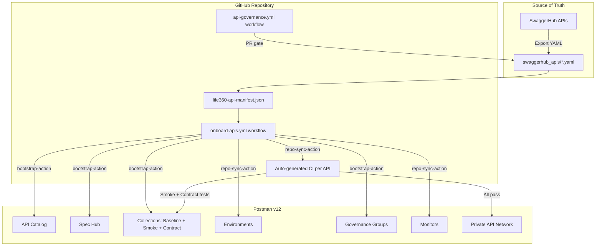
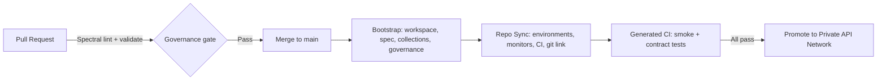
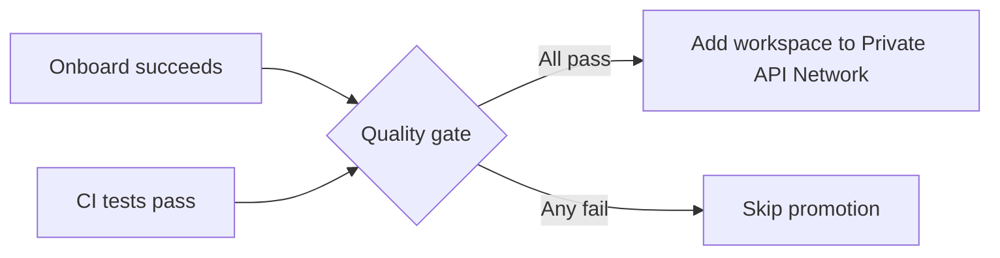

# Life360 SwaggerHub → Postman v12 Migration

CI-driven pipeline that migrates Life360 APIs from SwaggerHub into the **Postman v12 API Catalog** with governance, contract testing, and environment management baked in from day one.

Built on the [`postman-cs` open-alpha GitHub Action suite`](https://github.com/postman-cs/postman-api-onboarding-action):

| Action | Role |
|--------|------|
| [`postman-api-onboarding-action`](https://github.com/postman-cs/postman-api-onboarding-action) | Composite orchestrator — chains bootstrap → repo-sync |
| [`postman-bootstrap-action`](https://github.com/postman-cs/postman-bootstrap-action) | Workspace, Spec Hub upload, collection generation, governance |
| [`postman-repo-sync-action`](https://github.com/postman-cs/postman-repo-sync-action) | Environments, monitors, CI workflow generation, git linking |
| [`postman-insights-onboarding-action`](https://github.com/postman-cs/postman-insights-onboarding-action) | Insights discovered-service linking (optional, for K8s) |

## Architecture



## Pipeline at a Glance



**On pull request** — the `api-governance` workflow lints every changed spec with Spectral and validates the manifest structure. Specs that violate OpenAPI standards or miss required fields block the merge.

**On merge to main** — the `onboard-apis` workflow reads `life360-api-manifest.json`, builds a matrix of APIs, and runs `postman-api-onboarding-action` for each one. Each API gets:

- A dedicated Postman **workspace** registered in the **API Catalog**
- The OpenAPI spec uploaded to **Spec Hub**
- **Baseline**, **Smoke**, and **Contract** collections generated from the spec
- **Environments** with runtime URLs (prod, staging, etc.)
- **Governance group** assignment
- A per-API **CI workflow** committed to the repo for ongoing smoke and contract testing
- **Workspace ↔ repo git link** via Bifrost

## Quick Start

### 1. Configure secrets

The workflows require these GitHub repository secrets:

| Secret | How to get it |
|--------|---------------|
| `POSTMAN_API_KEY` | Postman → Settings → API Keys → Generate (starts with `PMAK-`) |
| `POSTMAN_ACCESS_TOKEN` | `postman login` → `cat ~/.postman/postmanrc \| jq -r '.login._profiles[].accessToken'` |
| `GH_FALLBACK_TOKEN` | GitHub PAT with `actions:write` + `contents:write` (for generated workflow commits) |

```bash
gh secret set POSTMAN_API_KEY       --repo <owner>/<repo>
gh secret set POSTMAN_ACCESS_TOKEN  --repo <owner>/<repo>
gh secret set GH_FALLBACK_TOKEN    --repo <owner>/<repo>
```

> `POSTMAN_ACCESS_TOKEN` is a session token required for governance assignment and workspace linking. It expires and must be refreshed periodically (see [open-alpha docs](https://github.com/postman-cs/postman-api-onboarding-action#obtaining-postman-access-token-open-alpha)).

### 2. Add API specs

Place OpenAPI YAML files under `swaggerhub_apis/<project>/`:

```
swaggerhub_apis/
└── life360/
    ├── circles-api-1.0.0.yaml
    ├── places-api-2.1.0.yaml
    └── safety-api-1.0.0.yaml
```

### 3. Register APIs in the manifest

Add each API to `life360-api-manifest.json`:

```json
{
  "organization": "Life360",
  "domain": "life360-platform",
  "domain_code": "L360",
  "governance_mapping": {
    "life360-platform": "Life360 API Platform"
  },
  "apis": [
    {
      "name": "circles-api",
      "spec_path": "swaggerhub_apis/life360/circles-api-1.0.0.yaml",
      "spec_url": "",
      "environments": ["prod"],
      "runtime_urls": {
        "prod": "https://api.life360.com/v3"
      }
    },
    {
      "name": "places-api",
      "spec_path": "swaggerhub_apis/life360/places-api-2.1.0.yaml",
      "spec_url": "",
      "environments": ["prod", "staging"],
      "runtime_urls": {
        "prod": "https://api.life360.com/v2",
        "staging": "https://staging-api.life360.com/v2"
      }
    }
  ]
}
```

| Field | Required | Description |
|-------|----------|-------------|
| `name` | Yes | Unique API identifier, used in workspace and asset naming |
| `spec_path` | Yes | Repo-relative path to the OpenAPI YAML file |
| `spec_url` | No | Remote spec URL override (e.g. SwaggerHub URL). When blank, the workflow constructs a raw GitHub URL from `spec_path` |
| `environments` | Yes | Environment slugs to create in Postman |
| `runtime_urls` | No | Map of environment slug → base URL for generated environments |

The top-level `private_network` object is optional:

| Field | Default | Description |
|-------|---------|-------------|
| `private_network.folder_name` | `<organization> APIs` | Name of the folder in the Private API Network |
| `private_network.folder_description` | Auto-generated | Description shown on the folder |

### 4. Push and watch

```bash
git add swaggerhub_apis/ life360-api-manifest.json
git commit -m "feat: add circles-api for v12 onboarding"
git push
```

The `onboard-apis` workflow runs automatically. Check the Actions tab for a per-API summary with workspace URLs, spec IDs, and collection IDs.

To re-run a single API manually: **Actions → Onboard Life360 APIs → Run workflow** and enter the API name in the `api-filter` field.

## Workflows

| Workflow | Trigger | Purpose |
|----------|---------|---------|
| [`onboard-apis.yml`](.github/workflows/onboard-apis.yml) | Push to `main` (spec/manifest changes), `workflow_dispatch` | Full onboarding pipeline per API |
| [`api-governance.yml`](.github/workflows/api-governance.yml) | Pull request (spec/manifest changes) | Spectral lint, manifest validation, spec structure check |
| `postman-ci-<api-name>.yml` | Auto-generated by `repo-sync-action` | Smoke + contract tests using Postman CLI |
| [`promote-to-private-network.yml`](.github/workflows/promote-to-private-network.yml) | After onboard or CI succeeds, `workflow_dispatch` | Promote qualifying workspaces to Private API Network |

## Private API Network Promotion

After an API passes all quality gates — Spectral lint, onboarding, smoke tests, and contract tests — the `promote-to-private-network` workflow automatically adds its workspace to the team's [Private API Network](https://learning.postman.com/docs/collaborating-in-postman/private-api-network/managing-private-network/).

The workflow:

1. **Quality gate** — checks that the most recent runs of `onboard-apis.yml` and `postman-ci-<api-name>.yml` both succeeded on `main`.
2. **Folder creation** — ensures a Private API Network folder exists (name configurable in the manifest under `private_network.folder_name`). Idempotent — re-runs reuse the existing folder.
3. **Workspace promotion** — adds each qualifying workspace to the folder. Already-listed workspaces are skipped.

The workflow runs automatically when the onboarding or CI pipeline completes on `main`, or can be triggered manually with an optional `api-filter` and a `force` flag to bypass quality gate checks.



## Governance

Governance is enforced at two levels:

1. **Pre-merge (CI)** — Spectral lints every OpenAPI spec against the `.spectral.yaml` ruleset. Required fields like `operationId`, `servers`, and `info.description` are enforced. The PR is blocked until all specs pass.

2. **Post-merge (Postman)** — The bootstrap action assigns each workspace to the governance group defined in `governance_mapping`. Spec Hub lints the uploaded spec using Postman's built-in rules.

Edit `.spectral.yaml` to add or adjust rules for Life360's API standards.

## Testing

After the first onboarding run, `repo-sync-action` auto-generates a CI workflow per API at `.github/workflows/postman-ci-<api-name>.yml`. These workflows use the Postman CLI to run:

- **Smoke tests** — basic reachability and response shape validation
- **Contract tests** — full schema compliance against the spec

Collection UIDs and environment IDs are read from `.postman/resources.yaml` (committed by repo-sync).

## Project Structure

```
.
├── .github/
│   └── workflows/
│       ├── onboard-apis.yml              # Main onboarding pipeline
│       ├── api-governance.yml            # PR-time spec validation
│       ├── promote-to-private-network.yml # Quality-gated Private API Network promotion
│       └── postman-ci-*.yml              # Auto-generated test workflows
├── .postman/                             # Generated by repo-sync (auto-committed)
│   └── resources.yaml
├── .spectral.yaml                        # Spectral OpenAPI lint ruleset
├── life360-api-manifest.json             # API registry / manifest
├── postman/                              # Generated by repo-sync (auto-committed)
│   ├── collections/
│   ├── environments/
│   └── globals/
├── swaggerhub_apis/                      # Source OpenAPI specs
│   └── life360/
│       └── circles-api-1.0.0.yaml
├── tools/
│   └── upload_postman_apis.py            # Legacy manual uploader (fallback)
├── BUILD_LOG.md
└── README.md
```

## Using SwaggerHub URLs Directly

If Life360 specs are still hosted on SwaggerHub during migration, set `spec_url` in the manifest to the SwaggerHub download URL instead of relying on the raw GitHub fallback:

```json
{
  "name": "circles-api",
  "spec_path": "swaggerhub_apis/life360/circles-api-1.0.0.yaml",
  "spec_url": "https://api.swaggerhub.com/apis/life360/circles-api/1.0.0/swagger.yaml",
  "environments": ["prod"],
  "runtime_urls": { "prod": "https://api.life360.com/v3" }
}
```

The bootstrap action fetches the spec from `spec_url` and uploads it to Spec Hub. The local copy in `swaggerhub_apis/` is used for PR-time linting only.

## Private Repository Note

If this repository is private, the raw GitHub URL fallback (`raw.githubusercontent.com`) may not be accessible to the bootstrap action's internal fetch. In that case, provide an explicit `spec_url` pointing to a registry or hosting endpoint that the action can reach (SwaggerHub, API gateway, GitHub Pages, etc.).

## Legacy Manual Script

`tools/upload_postman_apis.py` is the original manual upload script. It is preserved as a fallback for ad-hoc runs outside of CI but is superseded by the GitHub Actions pipeline for production use.

```bash
pip install requests pyyaml
python tools/upload_postman_apis.py --config test_config/config.json
```
